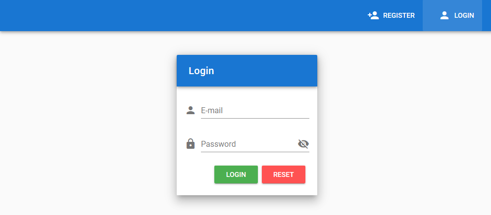

# Inventory Persistent WebApp
An inventory app based on vue.js, typescript, vuetify and firebase ([Live demo](https://invpwa.firebaseapp.com/)).

## Todo list
- [X] Fix firebase hosting deployment
- [X] Bugfix registration password
- [X] Async sign-in/sign-up notification from store to UI
- [ ] Notifications font customization
- [ ] Inventory data table view
- [ ] Inventory operations w/ firebase firestore
- [ ] Barcodes camera scanner using firebase
- [ ] Barcodes LUT

## Project setup
<!-- Already done. -->

<!-- ## Screenshot -->
<!-- 
*Login page*

||
|:--:| 
| *Login page* |

 -->

<!-- <p>
    
    <br>
    <em>Login page</em>
</p> -->

<!-- Webpack is a module bundler for Javascript applications
Vuex: state manager -->

``` bash
# packages required for development purpose (--save-dev)
$ npm install --save-dev typescript webpack ts-loader css-loader vue vue-loader vue-template-compiler

$ npm install -g @vue-cli # vue v3
$ vue add pwa # https://github.com/vuejs/vue-cli/tree/dev/packages/%40vue/cli-plugin-pwa#installing-in-an-already-created-project
$ vue create inventory-pwa
# Manually select features: Babel, Typescript, PWA, Router, Vuex, Linter=PrettierOnSave, config in package.json

# Adding vuetify
$ vue add vuetify

# Install firebase
$ npm install firebase --save
$ npm install -g firebase-tools

$ firebase init

# Easy dialogs and toasts
$ npm install vuetify-dialog
```

### Lints and fixes files
``` nash
$ npm run lint
```

### Compiles and hot-reloads for development (Starting development server...)
```
$ npm run serve 
```

### Run local server
```
$ npm run build
# Refresh browser cache: crtl + shift + R
$ firebase serve
```
### Deployment on Firebase
```
$ firebase deploy
# or
$ firebase deploy --only hosting
```

### Firebase configuration
- `.env` file in the root path of our app, which will contain all the details which are needed when our app running on every mode.
- `.env.local` file which will contain all the details which are needed for our app to be executed in locally (see `.env.local.empty` and replace values). We are keeping our firebase credentials in here. Contains firebase keys to the app. (`main.ts`)


<!-- ## Debugging in VS Code (see [here](https://github.com/nordprojects/vue-ts-fire-template))

- Install the 'Debugger for Chrome' plugin.
- Ensure the dev server is running at port 8080.
- Type `debugger;` in the code where you want to break.
- In the debugger panel, start the `vuejs: chrome` configuration -->

<!-- 
```
$ npm install material-icon
$ npm install material-icons

# install ICONS locally using yarn or npm. Keep in mind that this is not an official google repository and may not receive updates
$ npm install material-design-icons-iconfont -D
``` -->


## Useful Links
- [Microsoft TypeScript Vue Boilerplate](https://github.com/Microsoft/TypeScript-Vue-Starter)
- [Vuetify and FireBase authentication](https://www.freecodecamp.org/news/how-to-build-a-spa-using-vue-js-vuex-vuetify-and-firebase-adding-authentication-with-firebase-d9932d1e4365/)
- [Vuetify is a material design components framework documentation](https://vuetifyjs.com/en/getting-started/quick-start)
- [Vuetify Material Dashboard DEMOS](https://demos.creative-tim.com/vuetify-material-dashboard/documentation/#getting-started)
- [Meal-prep github, Nice tutorial for app structure](https://github.com/ratracegrad/meal-prep)
- [Meal-prep tutorial](https://medium.com/js-dojo/how-to-build-a-single-page-application-using-vue-js-vuex-vuetify-and-firebase-838b40721a07)
- [vuetify-dialog for easier dialogs and notification toasts](https://github.com/yariksav/vuetify-dialog)

- [source, nice tutorial, authentication firebase](https://medium.com/javascript-in-plain-english/how-to-implement-a-showcase-web-app-in-vue-js-with-firebase-and-register-functionality-part-1-992089d17828)

